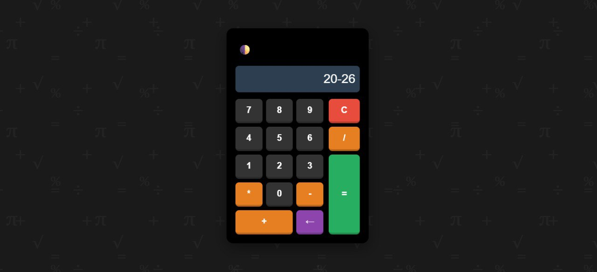
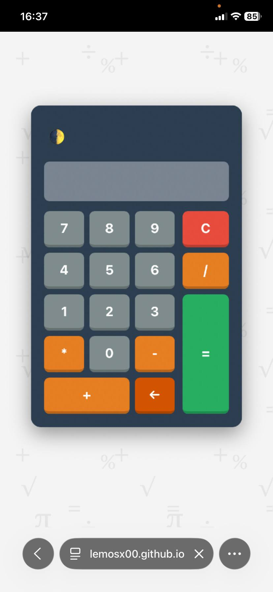

# 🧮 Calculadora Pro - Lemosx00

Aplicação web moderna e responsiva, criada com foco em UX, performance e design interativo.  
Permite operações matemáticas básicas, alternância de tema claro/escuro e suporte a atalhos de teclado.

---

## 🎯 Objetivo do Projeto

Praticar manipulação de eventos, controle de estado e persistência de dados no navegador, simulando funcionalidades de apps reais.

---

## 🚀 Funcionalidades

- ✅ Operações matemáticas: soma, subtração, multiplicação e divisão  
- ✅ Alternância entre modo claro e escuro  
- ✅ Detecção automática do tema do sistema  
- ✅ Persistência de preferência de tema via LocalStorage  
- ✅ Interface 100% responsiva  
- ✅ Fundo animado com CSS  
- ✅ Suporte a atalhos de teclado  

---

## 📸 Preview

### Desktop

### Mobile

### Em ação (GIF)

---

## 🛠️ Tecnologias

- HTML5  
- CSS3 (Flexbox, animações e responsividade)  
- JavaScript (ES6+)  
- LocalStorage API  

---

## 🔗 Demonstração

Teste online a calculadora:  
[https://lemosx00.github.io/calculadora/](https://lemosx00.github.io/calculadora/)

---

## 📩 Contato

Entre em contato via WhatsApp:  

---

Desenvolvido por Guilherme Lemos 🚀  
Desenvolvedor em aprendizagem
